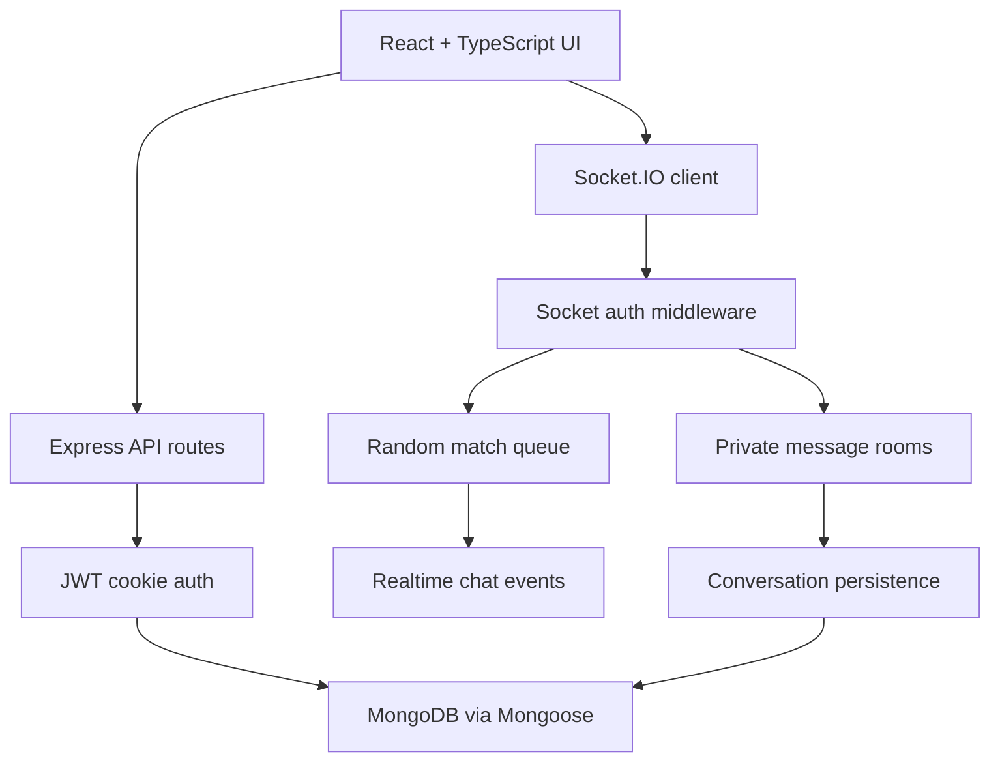

# Realtime Match Chat

Realtime Match Chat is a full-stack chat platform built around random user matching, friend requests, private conversations, and persistent message history.

The backend uses Node.js, Express, Socket.IO, MongoDB, Mongoose, JWT cookies, and bcrypt. The frontend is a React + TypeScript interface for the main chat workflows.

## Features

- JWT-based signup and login
- Password hashing with bcrypt
- Random chat matchmaking over Socket.IO
- Private friend-to-friend messaging
- Friend request, accept, reject, and remove flows
- User search
- MongoDB-backed user and conversation models
- Server-rendered EJS pages for backend chat views
- React + TypeScript frontend shell for a cleaner dashboard UI

## System Workflow



## Tech Stack

- **TypeScript**
- **React**
- **Node.js**
- **Express.js**
- **Socket.IO**
- **MongoDB**
- **Mongoose**
- **JWT**
- **bcrypt**
- **EJS**
- **Helmet**
- **CORS**
- **Morgan**

## Backend Setup

Create an environment file from the example:

```bash
cp .env.example .env
```

Install backend dependencies:

```bash
npm install
```

Start the backend:

```bash
npm run dev
```

The backend runs on:

```text
http://localhost:3000
```

## Frontend Setup

```bash
cd frontend
npm install
npm run dev
```

The frontend expects the backend API and Socket.IO server to be available locally.

## Project Structure

```text
realtime-match-chat/
├── app.js
├── controllers/
├── middleware/
├── models/
├── random_chat/
├── routes/
├── views/
├── public/
└── frontend/
    ├── src/
    ├── package.json
    └── tsconfig.json
```

## Notes

Secrets are intentionally kept out of the repository. Use `.env.example` as the template for local configuration.

## Maintenance Notes

- Keep `.env` local and rotate `jwt_key` per environment.
- Treat Socket.IO events as part of the API contract; update both the browser clients and server handlers together.
- Store only conversation data needed for the chat experience, and avoid logging message bodies in production.
- The React TypeScript dashboard is structured as a typed client surface over the existing Express and Socket.IO backend.
